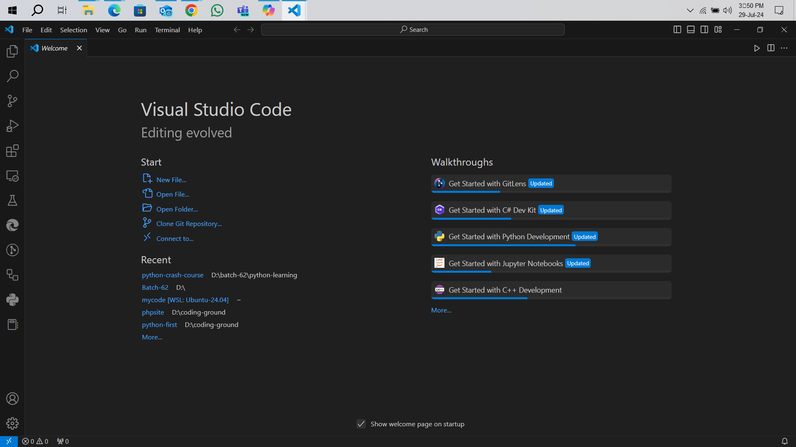
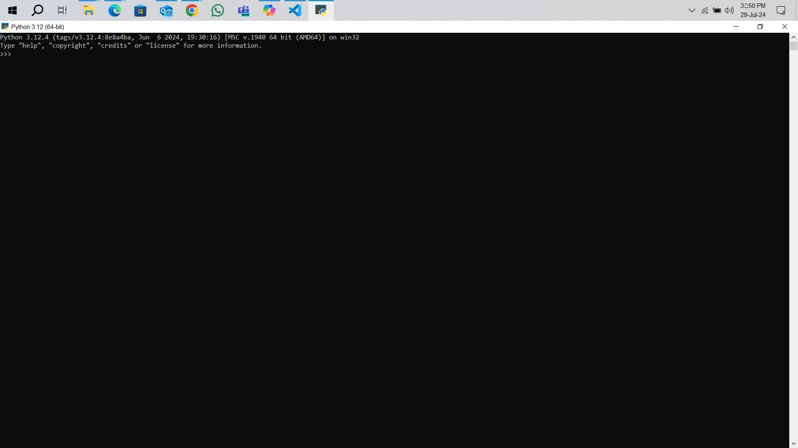
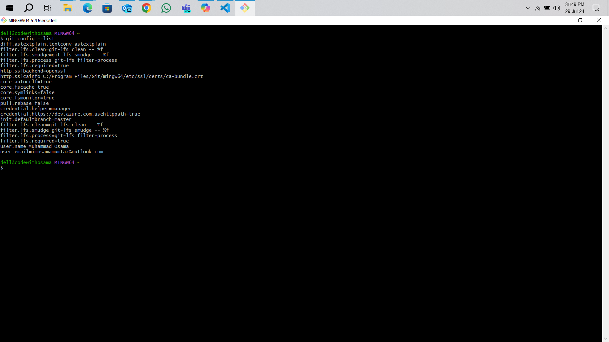
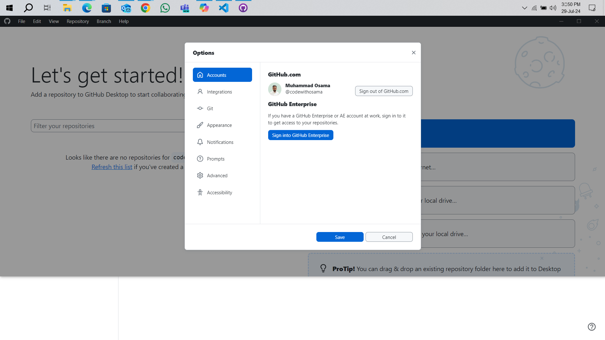
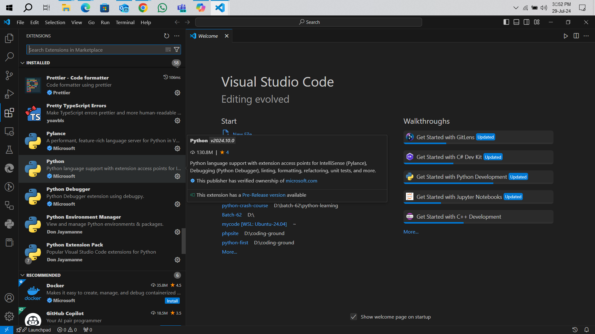

# Setting Up Your Development Environment
**Objective:** Install essential development tools and configure Git to begin software development
projects.

**Instructions:** This assignment will walk you through the process of setting up your development
environment by installing Visual Studio Code, Python, and GitBash, and by setting up a GitHub
account. You will also install several useful extensions in Visual Studio Code to enhance your
coding experience.

## Part 1: Installation of Tools

### **Visual Studio Code Installation**
1. Download VS Code from Visual Studio Code Official Website.
2. Follow the installation instructions on the website.
3. Submission: Take a screenshot of the VS Code running on your computer.

### **Python Installation**
1. Download Python from Python Official Downloads.
2. During installation, ensure to select the checkboxes:
    - Add Python to PATH
    - Install launcher for all users (recommended)
    - To verify the installation, open your terminal or command prompt and run: \
     `python --version`
5. Submission: Take a screenshot of the terminal showing the Python version.

### **GitBash Installation**
1. Download GitBash from GitBash Downloads.
2. Follow the installation instructions provided.
    - To verify installation, open GitBash and type: \
      `git --version`
3. Submission: Take a screenshot of the GitBash window showing the Git version.

<table>
    <tr>
        <td><h3></h3>Git Bash</h3></td>
        <td><h3></h3>Github</h3></td>
    </tr>
    <tr>
        <td> </td>
        <td></td>
    </tr>
</table>

## Part 2: Setting Up Git & GitHub Account
1. Create a GitHub Account at GitHub.
    - Configure your Git account with your name and email by running these commands in GitBash: \
      `git config --global user.name "Your Name"` \
      `git config --global user.email "youremail@example.com"`
    - Check your current configuration with: \
      `git config --list`
2. Submission: Take a screenshot of your Git configuration settings in GitBash.

## Part 3: VS Code Extensions
1. Install the following extensions in Visual Studio Code by searching them in the Extensions view: `(Ctrl+Shift+X)`
    - Material Icon Theme
    - GitLens – Git supercharged
    - Prettier – Code formatter
    - Python
    - Python debugger
    - Jupyter
    - Code Spell Checker

_____________________________________
**Detailed Version of Assignment in 📃 [PDF](Setting%20Up%20Your%20Development%20Environment.pdf)**
